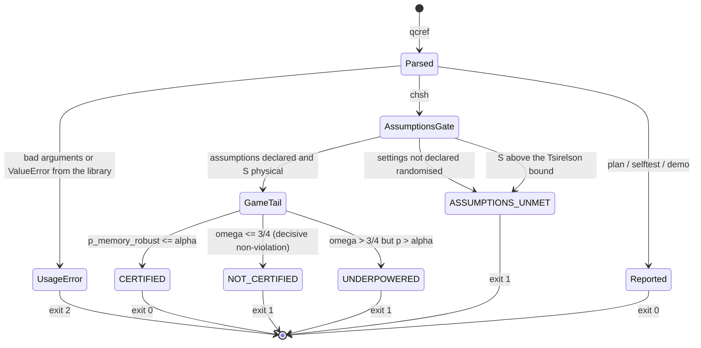

# App Flow — the `qcref` command line

**Date:** 2026-08-03 · **PRD:** [PRD.md](PRD.md) · **TDD:** [TDD.md](TDD.md)

This project has no graphical interface. Its interactive surface is a four-command
CLI plus the library API, so "screens" below are commands and "states" are the
verdict statuses and exit codes. Sections of the standard template that describe a
web session — unauthorised, offline, deep links — are cut rather than padded: there
is no account, no server and no network call anywhere in the package.

## Entry points

- `qcref <command>` — the console script installed by `pip install -e .`
  (`[project.scripts] qcref = "qcref.cli:main"`).
- `python -m qcref.cli <command>` — works via the `__main__` guard in `cli.py`.
  `python -m qcref` does **not** work: there is no `__main__.py`.
- `python examples/run_example.py` — the same five acts as `demo`, fully offline,
  runnable without installing.
- `import qcref as qr` — the library path; the CLI adds no logic of its own beyond
  argument parsing and the exit code.

Everything is local. Nothing here reads a config file, an environment variable, or a
network resource, so behaviour depends only on the arguments given.

## The happy path

The intended first session is four commands, in this order.

1. **`qcref demo`** — prints the wedge with no arguments to get wrong: the same data
   judged at *n* = 80 (refused) and *n* = 8000 (certified), a best-of-6 scan under
   Holm, and a plan. Exit 0. This is the "what does this tool even claim" screen.
2. **`qcref selftest --n 80`** — the credibility check, run against the tool itself:
   naive observed-SE false-positive rate 0.0748 against a nominal 0.05, the game
   tail 0.0410, Wilson coverage 0.9628 against a nominal 0.95 (conservative, as it
   should be). Re-run with `--n 8000` to watch the gap
   close, which is the honest half of the pitch. Exit 0.
3. **`qcref plan --S 2.4 --alpha 0.05 --power 0.9`** — before spending shots: 604
   rounds, certify iff wins ≥ 471, exact power 0.9007. Exit 0.
4. **`qcref chsh --wins 66 --rounds 80 --randomised`** — the actual judgement on real
   data. Prints the status, the memory-robust p-value marked `<- use this`, the two
   contrast p-values, the declared assumptions, and — when UNDERPOWERED — how many
   rounds 90% power would take if the observed win rate persists. **Exit 1**, because
   this run does not certify.

Step 4 is the only command whose exit code carries information. `--randomised` is
required to certify at all: omitting it is not an error, it is `ASSUMPTIONS_UNMET`.

## Every state of every command

| Command | Success | Refusal (still a normal outcome) | Bad input | Slow / heavy |
|---|---|---|---|---|
| `chsh` | `CERTIFIED` → exit 0 | `UNDERPOWERED`, `NOT_CERTIFIED`, `ASSUMPTIONS_UNMET` → exit 1, each with a printed reason | `wins > rounds`, α or level outside (0, 1), non-positive rounds → usage message, exit 2 | instant |
| `plan` | prints the minimal *n*, critical wins, exact power, and the sawtooth note → exit 0 | none — an unreachable request is an input error, not a refusal | `--S` at or below 2 / win rate ≤ 3/4, both or neither of `--S`/`--win-rate`, target unmet within `--max-rounds` → exit 2 | linear scan in *n*; a target needing millions of rounds takes seconds and then raises rather than hanging silently |
| `selftest` | prints the false-positive table and Wilson coverage → exit 0 | none | `--n <= 0`, `--trials <= 0` → exit 2 | ~1 s at defaults (100 000 trials, vectorised) |
| `selftest --adversarial` | prints the exact ceiling and a scorecard per adversary, each flagged `<- bounded` or `<- CHECK` → exit 0 | none | as above | ~1 s at the 2000-trial default; ~2 s at *n* = 1000 × 4000 trials. Vectorised across trials, sequential in rounds |
| `demo` | prints the five-act worked example → exit 0 | none | none — takes no arguments | ~1 s |
| *(any)* | `--version`, `--help` → exit 0 | — | no subcommand → usage message, exit 2 | — |

Notes on the states that matter:

- **There is no empty state.** Every command either takes explicit numbers or has
  none to take; there is no store that can be empty and no first-run setup.
- **Refusal is not an error.** `UNDERPOWERED` and `ASSUMPTIONS_UNMET` print a full
  result with a reason and exit 1. That distinction — exit 1 means *judged and not
  certified*, exit 2 means *the question was malformed* — is what lets `qcref chsh`
  sit in a CI gate without a wrapper script.
- **No traceback ever reaches the user.** `main()` catches `ValueError` from the
  library and routes it through `parser.error`, so `wins=90 must satisfy 0 <= wins <=
  rounds=80` is printed as a usage error, not a stack trace.
- **No progress output.** A heavy `--adversarial` run prints nothing until it
  finishes. At shipped defaults that is about a second, so no spinner is warranted;
  if a run ever took minutes this would become a real dead-air state.
- **The naive p-value is always labelled.** It appears in `chsh` output as
  `(for contrast only)` and in the self-test as `<- INVALID (inflated)`. It exists to
  show the gap, and no path lets it decide anything.

## Transitions

The order of the `chsh` gates is load-bearing: assumptions and physicality are
checked **before** the p-value, so data implying an impossible *S* can never be
certified however small its p-value is. `selftest` mirrors that same order, and
re-checks 64 runs per batch against `chsh()` itself so the two cannot drift.

## Dead ends

None. Every terminal state prints either a next action or the reason no action
helps:

- `UNDERPOWERED` prints roughly how many rounds would reach 90% power at the observed
  win rate, labelled with the assumption that the rate persists.
- `NOT_CERTIFIED` with ω ≤ 3/4 is evidence *against* a violation; the adversarial
  self-test's closing note says so explicitly — more rounds will not rescue a
  genuinely local source, and `plan` refuses to price one.
- `ASSUMPTIONS_UNMET` names the unmet assumption. For the Tsirelson refusal it also
  names the usual cause (a missing or non-uniform setting), which is the actionable
  part.
- A `plan` request that cannot be met within `--max-rounds` says to raise
  `--max-rounds` rather than failing blankly.

## Accessibility and terminal behaviour

- Plain ASCII on stdout. No colour, no ANSI escapes, no cursor control, no Unicode
  box drawing, no progress bars — so output is identical in a pipe, a log, a CI
  transcript, and a screen reader. **Colour is never the only signal because colour
  is never used at all.**
- No interactive prompts: every command runs to completion from its arguments, which
  makes the tool scriptable and keeps it usable without a mouse or a TTY.
- Output fits an 80-column terminal: the widest line in a rendered report is 80
  characters (a caveat line). The one exception is the UNDERPOWERED planning hint,
  which reaches 110 characters and will wrap. Nothing relies on terminal width being
  detected, because nothing is drawn.
- Status words are full words (`CERTIFIED`, `UNDERPOWERED`), never symbols or
  abbreviations, and the p-value to trust is signposted in text (`<- use this`).
